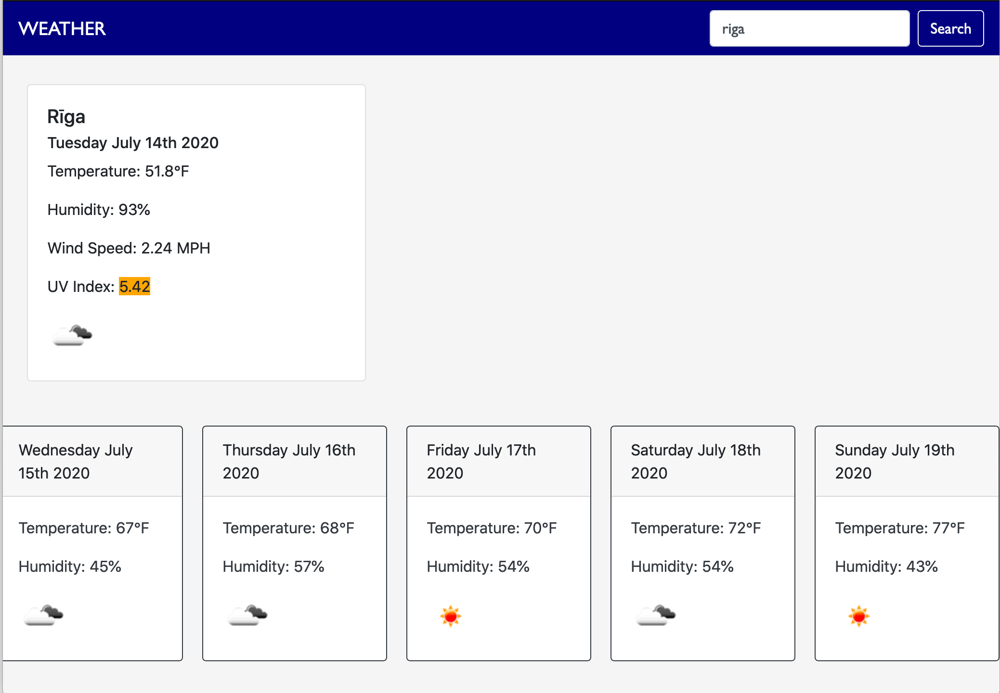

# WEATHER APP

## https://drlanah.github.io/hw-6/

## Overview

- User inputs the name of a city into the search bar.
  Data is displayed for that date, with the temperature, humidity, wind speed, UV index, and an icon to correspond with the weather.

- The UV index number is highlighted with colors to represent the level (light yellow for <2; yellow for 2-5; orange for 6-7; red for 8-10; and dark red for >10).

- The user is also presented with a five-day forecast, displaying the day, temperature, humidity, and corresponding icon for each day.

- The data for the weather information was pulled from an API, https://openweathermap.org/api.

## User Story

AS A traveler
I WANT to see the weather outlook for multiple cities
SO THAT I can plan a trip accordingly

## Preview

The following image demonstrates the application functionality:

